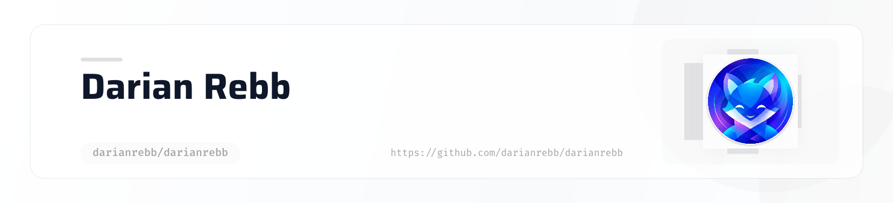

<picture>
   <source media="(prefers-color-scheme: dark)" srcset="art/header-dark.png">
   
</picture>

## Welcome!

I've build **My Gym Journey**, my first Swift app. It's been an exciting learning experience, and I'm passionate about creating useful tools that make a real impact. I'm learning the ins and outs of Swift and iOS development while hopefully creating something meaningful. I'm always eager to collaborate, learn from the community, and improve my craft.

<!--
## Hi there 👋
**darianrebb/darianrebb** is a ✨ _special_ ✨ repository because its `README.md` (this file) appears on your GitHub profile.

Here are some ideas to get you started:

- 🔭 I’m currently working on ...
- 🌱 I’m currently learning ...
- 👯 I’m looking to collaborate on ...
- 🤔 I’m looking for help with ...
- 💬 Ask me about ...
- 📫 How to reach me: ...
- 😄 Pronouns: ...
- ⚡ Fun fact: ...
-->
